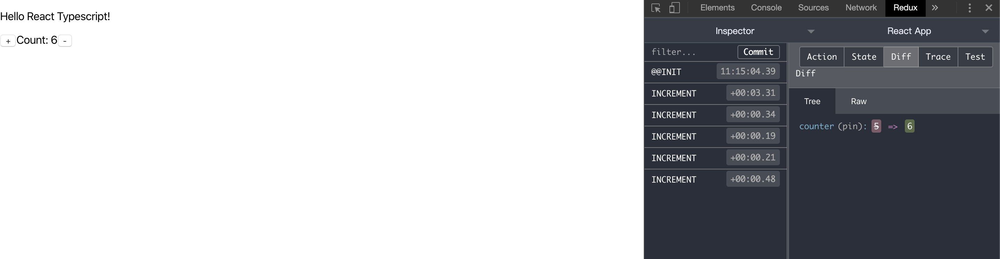

# React Typescript Tests

## 创建项目

1.通过 create-react-app 创建

```sh
# create-react-app
$ npx create-react-app my-app --template typescript
```

2.启动

```sh
# start
$ yarn start
```

## 第一个组件

1.创建一个函数式组件 Counter

```js
// counter.tsx 创建函数式组件Counter
export interface ICounter {
  value: number;
}

const counter = ({ value }: ICounter) => {
  return <p>点击了: {value} 次</p>;
};

// App.tsx 中 使用counter组件
import Counter from "./components/counter";

function App() {
  return (
    <div className="App">
      <Counter value={2} />
    </div>
  );
}
```

2.将 couter 改成类定义的组件

```diff
# counter.tsx
export interface ICounter {
    value: number;
}
- const counter = ({ value }: ICounter) => {
-   return <p>点击了: {value} 次</p>;
- };

+ class Counter extends React.PureComponent<ICounter> {
+   render() {
+       return <p>点击了: {this.props.value}次</p>;
+   }
+ }

```

## 使用 redux

### 安装 redux

```sh
# yarn add
$ yarn add redux react-redux @types/react-redux --save
```

### 创建一个 store

```typescript
// src/types/index.tsx
export interface StoreState {
  language: string;
  counter: number;
}
```

### 创建一个 action 类型

```typescript
// src/constants/index.tsx
export const INCREMENT = "INCREMENT";
export type INCREMENT = typeof INCREMENT;

export const DECREMENT = "DECREMENT";
export type DECREMENT = typeof DECREMENT;
```

### 创建 action

```typescript
// src/actions/index.tsx
import * as constants from "../constants";

export interface IIncrement {
  type: constants.INCREMENT;
}

export interface IDecrement {
  type: constants.DECREMENT;
}

export type CounterAction = IIncrement | IDecrement;

export function incrementCounter(): CounterAction {
  return {
    type: constants.INCREMENT
  };
}

export function decrementCounter(): CounterAction {
  return {
    type: constants.DECREMENT
  };
}
```

### 创建 reducer

```typescript
// src/reducers/index.tsx
import { CounterAction } from "../actions";
import { StoreState } from "../@types";
import { INCREMENT, DECREMENT } from "../constants";

export function counter(state: StoreState, action: CounterAction): StoreState {
  switch (action.type) {
    case INCREMENT:
      return { ...state, counter: state.counter + 1 };
    case DECREMENT:
      return { ...state, counter: Math.max(1, state.counter - 1) };
    default:
      return state;
  }
}
```

### 创建容器组件

> src/components/counter.tsx

```typescript
import * as React from "react";
import { connect } from "react-redux";
import { StoreState } from "../@types";
import { CounterAction, incrementCounter, decrementCounter } from "../actions";
import { Dispatch } from "redux";
```

1.定义 couter 组件的 props

```typescript
export interface ICounter {
  name: string;
  counter: number;
  onIncrement: () => void;
  onDecrement: () => void;
}
```

2.重写组件格式

```typescript
function counter({ name, counter = 1, onIncrement, onDecrement }: ICounter) {
  if (counter <= 0) {
    throw new Error("不能传入一个小于或等于0的数");
  }

  return (
    <div className="counter">
      <p>Hello {name}!</p>
      <div>
        <button onClick={onIncrement}>+</button>
        <span>Count: {counter}</span>
        <button onClick={onDecrement}>-</button>
      </div>
    </div>
  );
}
```

3.定义 mapStateToProps 和 mapDispatchToProps 函数

```typescript
export function mapStateToProps({ counter, language }: StoreState) {
  return {
    name: language,
    counter: counter
  };
}

export function mapDispatchToProps(dispatch: Dispatch<CounterAction>) {
  return {
    onIncrement: () => dispatch(incrementCounter()),
    onDecrement: () => dispatch(decrementCounter())
  };
}
```

4.与容器组件连接

```typescript
export default connect(mapStateToProps, mapDispatchToProps)(counter);
```

### 创建 store

> src/index.tsx

```typescript
import React from "react";
import ReactDOM from "react-dom";
import { createStore } from "redux";
import { Provider } from "react-redux";
import App from "./App";
import * as serviceWorker from "./serviceWorker";
import { StoreState } from "./@types";
import { counter } from "./reducer";

const win: any = window;
```

1.createStore

```typescript
const store = createStore<StoreState, any, any, any>(
  counter as any,
  {
    language: "React Typescript",
    counter: 1
  },
  win.__REDUX_DEVTOOLS_EXTENSION__ && win.__REDUX_DEVTOOLS_EXTENSION__()
);
```

2.设置 Provider store

```typescript
ReactDOM.render(
  <Provider store={store}>
    <App />
  </Provider>,
  document.getElementById("root")
);
```

## 结尾



## 参考

> TypeScript 中文手册: [https://typescript.bootcss.com/tutorials/react.html](https://typescript.bootcss.com/tutorials/react.html)
